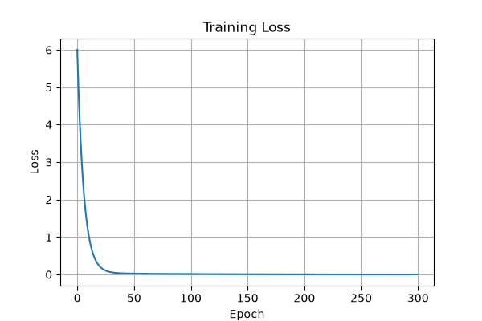
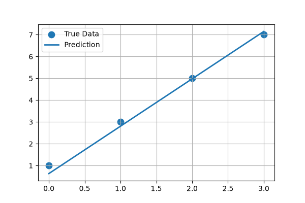
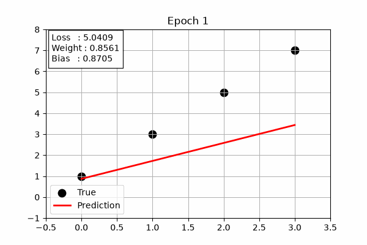

# Gradient Descent Visualizer

A modular PyTorch project demonstrating how a linear model learns an underlying relationship directly from data using gradient descent.

---

# Project Overview

This project trains a single-layer linear model (`torch.nn.Linear`) using PyTorch to learn a linear relationship between input and output data.

Instead of manually programming the rule, the model gradually adjusts its internal parameters (weight and bias) through gradient-based optimization until its predictions closely match the training data.

The goal of this project is to understand the complete supervised learning pipeline from data to prediction, loss computation, backpropagation, parameter optimization, and convergence.

---

# Features

- Built a single-layer linear model using `torch.nn.Linear`
- Trained via full-batch Stochastic Gradient Descent (SGD)
- Computed prediction error using Mean Squared Error (MSE)
- Snapshotted model state every epoch to reconstruct the full training trajectory
- Visualized training loss over time
- Validated learned parameters against known ground truth
- Animated the learning process through a training GIF
- Organized the project into modular components

---

# Project Structure

```text
gradient-descent-visualizer/

├── main.py
├── data.py
├── model.py
├── train.py
├── plot.py

├── outputs/
│   ├── loss_curve.png
│   ├── prediction_vs_truth.png
│   └── training.gif

├── requirements.txt
├── README.md
└── .gitignore
```

---

# Learning Pipeline

```text
Dataset
   │
   ▼
Linear Model
   │
   ▼
Predictions
   │
   ▼
Loss (MSE)
   │
   ▼
Gradients
   │
   ▼
Optimizer (SGD)
   │
   ▼
Updated Parameters
   │
   └──────────────┐
                  ▼
             Next Epoch
```

---

# Results

Trained for 300 epochs with a fixed random seed (42) for reproducibility.

| Metric | Value |
|---|---|
| Initial Loss | 6.0012 |
| Final Loss | 0.0011 |
| Convergence (loss < 0.01) | Epoch 118 |
| True Weight / Learned Weight | 2.0 / 1.9738 (1.31% error) |
| True Bias / Learned Bias | 1.0 / 1.0560 (5.60% error) |

## Training Loss

Shows how prediction error decreases as the model learns.



---

## Prediction vs Ground Truth

Comparison between the learned predictions and the true data.



---

## Learning Animation

Visualization of the optimization process across training epochs.



---

# Concepts Learned

- Representing data using tensors
- Building models with PyTorch's `nn.Module`
- Understanding weights and biases
- Forward propagation
- Loss computation using Mean Squared Error
- Automatic differentiation (Autograd)
- Gradient descent optimization
- Learning rate and parameter updates
- Visualizing model convergence
- Structuring machine learning projects into reusable modules

---

# Installation

```bash
pip install -r requirements.txt
```

---

# Run

```bash
python main.py
```

---

# Future Improvements

- Train on nonlinear datasets with a deeper network (hidden layers + activations)
- Compare different optimizers (Adam vs SGD)
- Add interactive parameter controls
- Extend to multivariate regression problems
- Visualize the actual loss landscape/surface as a function of weight and bias

---

# Resume Summary

Trained a single-layer linear model via full-batch SGD, reducing MSE loss by 99.98% (6.00 → 0.0011) and converging below a 0.01 loss threshold by epoch 118 of 300. Validated learned parameters against ground truth within 1.31% (weight) and 5.60% (bias) error.